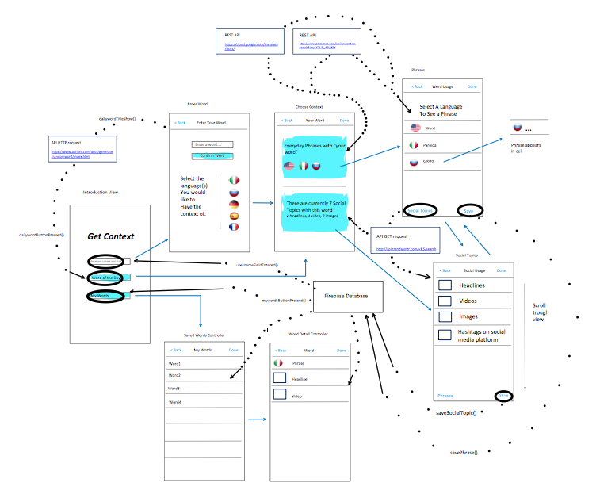
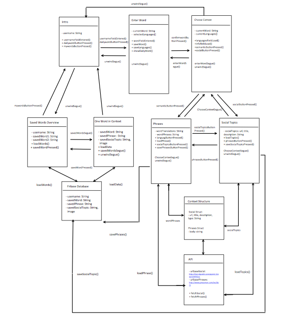
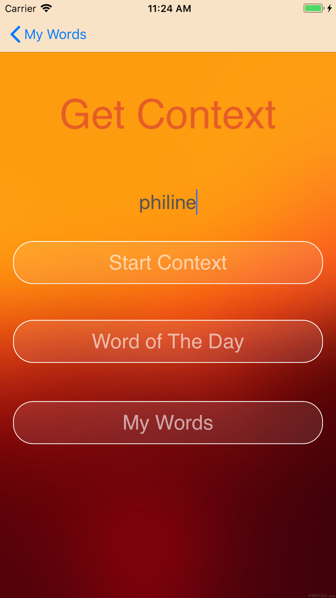
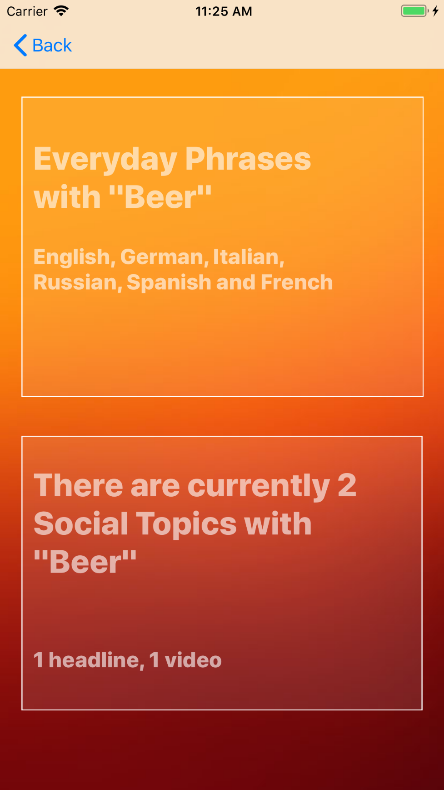
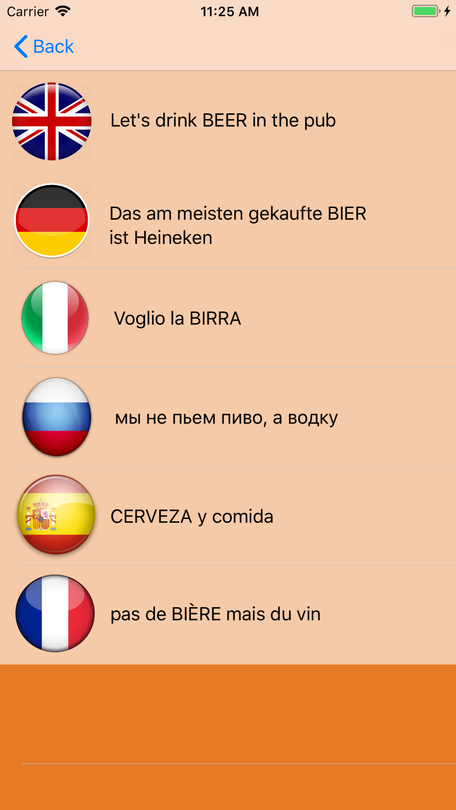
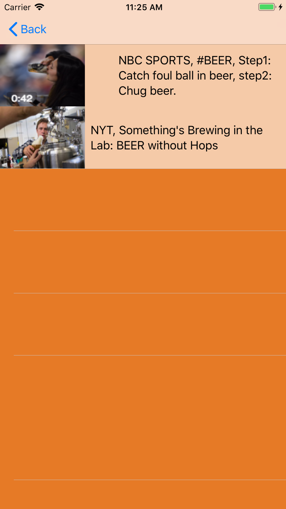

# Process Book 

# day 2
* Working on Design Document. 
* Making advanced UI sketch.
* Starting with diagrams of utilty modules. 
* Thinking about usage of API'S and possibly changing or removing one.

# day 3
* Finished Design Document.
* Finished UI sketch and diagrams. 

Advances UI Sketch

UML Sketch

* Found API for Random Word Generation, thinkin about removing translation api. 4 is too much.
* Database Field drawing for Design Document.

# day 4
* Started Prototype
* Only Layout and front-ent for presentation. 
* Use UI sketch to match prototype: removed several things from prototype used in sketch. 
* Thinking about changing word usage/social usage based on JSON output. 
* Thinking about app icon/ background colors/ ghost buttons. Made first AppIcon, not statisfied about logo and coloring. 

* Added Monsterratt font from https://fonts.google.com/.

# day 5
* Daily presentation, enjoying app-ideas from others. Good discussion. Showed App Simulator and added screenshots.

* Tweaked some layout: thinking about the setup, not statisied with front-end. 
* Feeling my app idea has a very specific target audience unlike others; which is not ideal, learning point. 

# day 6
* Ill, not able to do anything. 

# day 7
* Ill and only doing front-end today.
* Found app logo site and used it to make (hopefully) final design!  

* Source for design:  https://studio.tailorbrands.com/
* Source for App Icon Generator:  http://appicon.co/
* Made Final Launchboard and found final background coloring. 

* Statisfied about logo and coloring; not statisfied with coloring for table views, table view background is different than
  view controllers. Thinking about that. 

# day 8
* Recovering from illness.
* Removed Monsterrattt font and reference due to new layout. 
* Allow arbitrary connection in info.plist > HTTP request not working due to weak/unsafe connection?
* set up account at trendspotrr. Get API KEY SOCIAL USAGE:  36383f6a04ab2737d7e3e9db3cd1b697
* set cache size in AppDelegate, remember to check if size is good later.
* Remember to make/explore a borderline under textField. 

# day 9
* Found new API for generating new words&translation (Word Context) in one & other cool features! Old API doesn't seem to be working.
* HTTP request is safe and seems to work just fine for this API. 
* New API from: https://developer.oxforddictionaries.com/ set up account.
* API Key: 0541f5d55a33a989697d99e8947353e1
* Documentation instruction at https://developer.oxforddictionaries.com/documentation
* Problem: word translation is for one specific language, may reconsider loading translation for each language individually or whenever the user clicks on the language button.
* Thinking about implementing a Tab Controller for Word Context because new API has more 
features and options to explore.
* Add navigation bar tomorrow.

# day 10
* Weekly presentation. 
* Feedback on social topics: may try to use Google Api, will however mean to involve 3 diff
api voor image/articles/video's instead of 1 api. Considering. 

# day 11
* Decided to add tab controler for enter word/daily word/ my words. Statisfied with better user interface.
* Decided to add tab controler for contexts: content, general overview of word, phrases in different languages and social topics. 
* Fill in username & alert when not.
* Fill in word & alert when not. 
* Tried to Load in daily word and description, error with loading in structures. 
* Remember to clean Git. Remember to optionally add border with TextField. 
* Planning next comming days 1. Load in daily words, General context & content. 2. Phrases. 3.Social Context 4. FireBase & Layout.

# day 12
* Thinking about neccesity Firebase, lot of work and maybe not a must. Optional, thinking about it. 
* Organized Git, still not done. Remember to make sure to look up how to remove files. 
* Fixed almost all errors; loading in daily word and re-ordering the setup for the code in tableviews depended on
the json fix. Day with lots of errors/questions/frustrations.
* Also worked on interaction frond/back-end. 

# day 13
* Finished loading in daily word and general context. Almost done with Phrases. Lots of progress.
* Planning on finishing Phrases tomorrow morning + Social Context. 
* Still not sure about Firebase but maybe planning setup for fridaymorning. 
* currently focussing on makins sure all functions works; make notes of little tweaks in design for future.

# day 14
* Social context and phrases almost done. 
* Discussed firebase at presentation: considering using firebase only for words. 
* Tips about layout. Will implement those. 

# day 15
* Migraine, trip to the doctor. 

# day 16
* Set tab bar icons from http://www.iconbeast.com/free/

# day 17
* sources used for wordinfo: 
* http://examples.yourdictionary.com/phrase-examples.html
* google / wikipedia / oxforddictionaries
* www.dictionary.com/e/phonetic-spelling/

