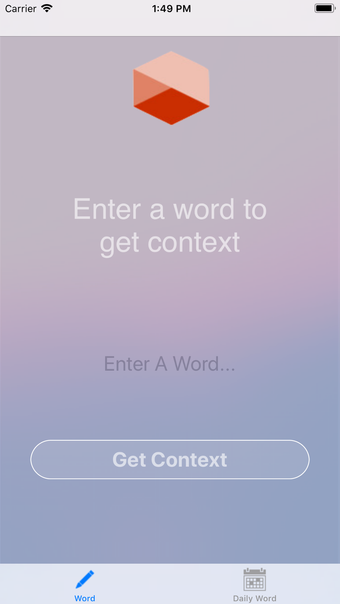
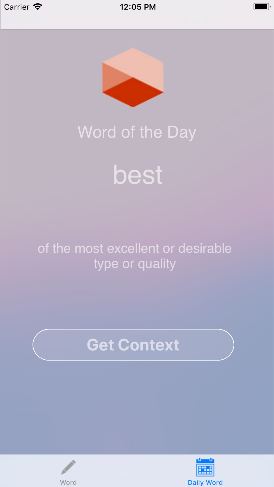
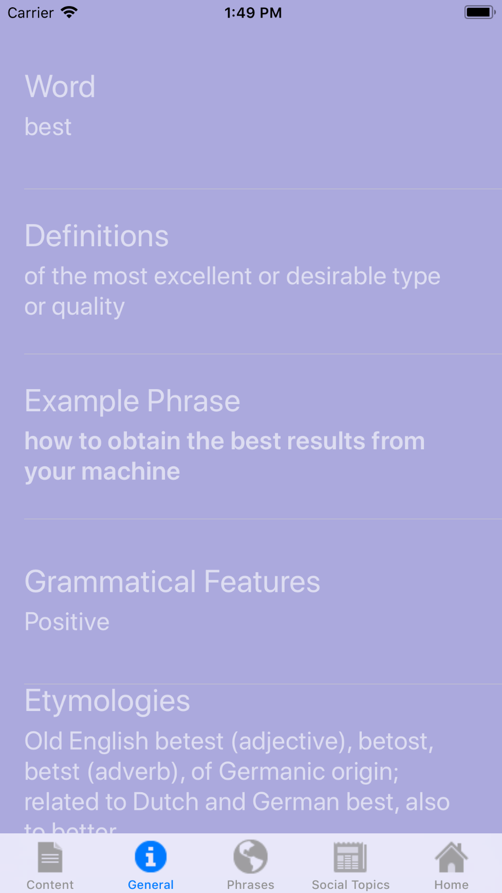
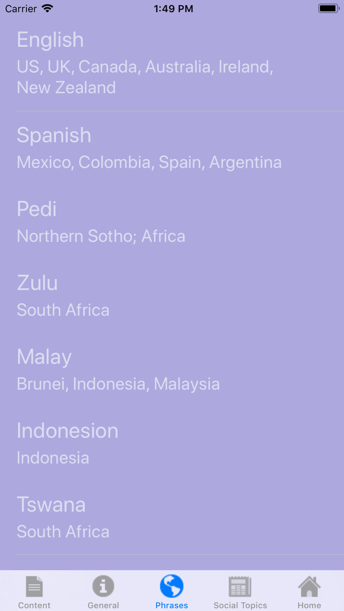
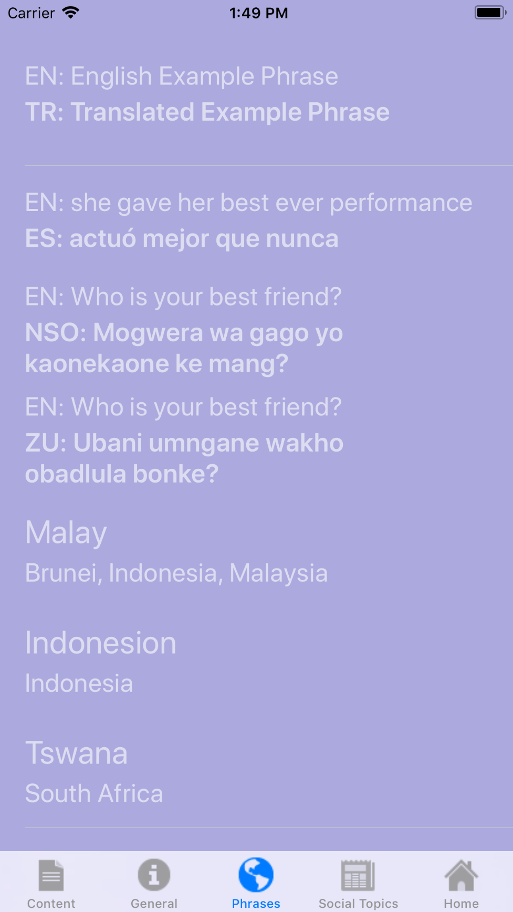
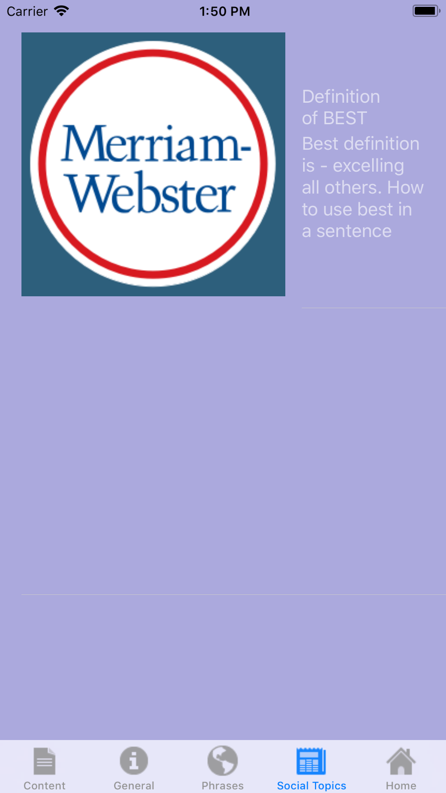

# GetContext
An app that allows the user to get semantic and cultural context of a word in another language.

## Purpose
The goal of this app is to give the user a quick overview of the semantic and cultural usages of a word in different languages to emphasize it's differences. This will help to prevent misunderstanding in communication and translation and hopes to advance understanding and learning of different language and apricate it's differences. The uses of this can be for learning a language, a situation in which knowledge of contextual differences of a word are needed: communication between two different language users (e.g. travellers or for business purposes) or simply curiosity. 

 

 
 
 

## Main Features 
The app allows you the enter a word OR check up the word of the day and get context.
Context consists of General Info, Phrases and Social Context. 
* General info about said word: Word, Definitions, Example Phrase,Grammatical Features, Etymologies, Lexical Category, Phonetic Spelling
* Phrases with everyday sentences in several languages: English, Spanish, Pedi, Zulu, Malay, Indonesion, Tswana, Urdu, German.
* Social Context: Google search returns with entered word including, headline, thumbnail, description. 

## Built with
* [Oxford Dictionary API](https://developer.oxforddictionaries.com/documentation) API Documentation for random word, translation & phrases 
* [Google Search API](https://developers.google.com/custom-search/json-api/v1/overview) API Documentation for Social usage
* [Xcode](https://developer.apple.com/xcode/) MacOs IDE to develop IOS apps.
* [App Development with Swift](https://itunes.apple.com/nl/book/app-development-with-swift/id1219117996?l=en&mt=11) Apple's official iBook about developing apps, used as a reference.

## Acknowledgements
* Many Thanks and acknowledgements to [PGDEV](https://stackoverflow.com/users/5716829/pgdev) for providing source code and being the original writer for the Google search API. 
* Many Thanks and acknowledgements to [Sergio Trejo](https://stackoverflow.com/users/8385022/sergio-trejo)
for providing feedback on this API [question](https://stackoverflow.com/questions/50936245/how-to-display-parsed-json-data-in-swift/50936354?noredirect=1#comment88941315_50936354.)
* Many thanks to jbreuer95 for solving the resizing of the screenshot 
on this README.md (listed as collaberator).

For General Info the following sources are used:
* http://examples.yourdictionary.com/phrase-examples.html
* google / wikipedia / oxforddictionaries
* www.dictionary.com/e/phonetic-spelling/

## Demo
* [See the demo in Dutch](https://youtu.be/LmAHF_lFU9k)

## Authors
Philine Wairata - June 28th, 2018. 
This is an open source software following the MIT-license. For more information see LICENSE.txt
